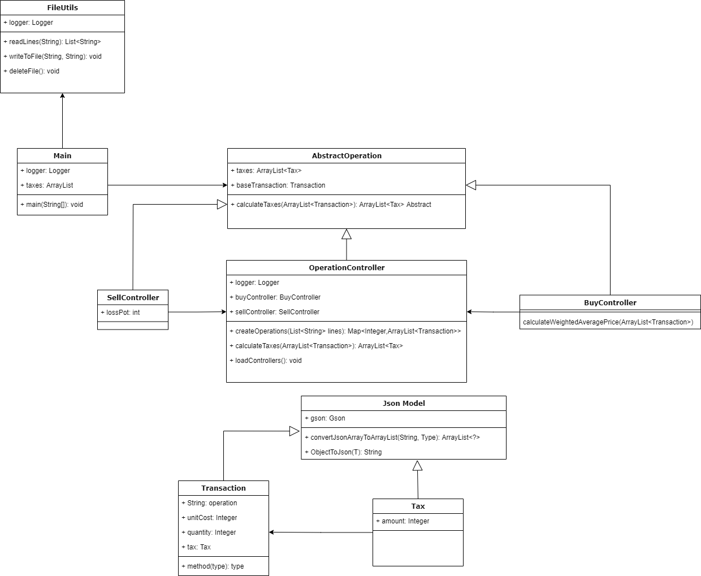
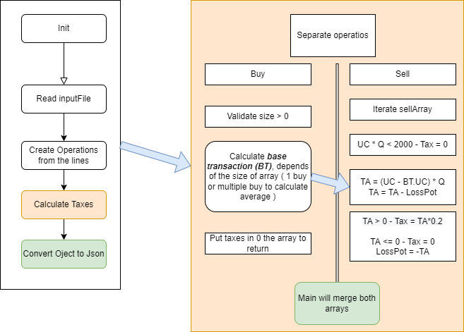

# Ejercicio Capital-Gains - Nubank

Challenge for NuBank.

- [Exercise](#exercise)
    - [Implementation and technologies](#implementation-and-technologies)
    - [Commentaries](#commentaries)
- [Setup](#setup)
    - [Instructions](#instructions)
- [Test](#test)
- [Tech Overview](#tech-overview)

## Exercise

### Implementation and technologies

- [Java 1.8](https://www.java.com/es/download/)
- Gson
- Mockito
- Log4j
- JUnit
- Lombok

### Commentaries

The exercise is about the capital gains tax, and his input was a json file with the transactions. In the description it said that the Sdin is just one operation, but in the json file there are many operations to iterate in my appoarch.
## Setup

### Instructions

I create a file with the input date, it is /resources/input.json, there you have to put the input data. Ex:

```
[{"operation":"buy", "unit-cost":10, "quantity": 10000}, {"operation":"sell","unit-cost":20, "quantity": 5000}]
[{"operation":"buy", "unit-cost":10, "quantity": 100},{"operation":"sell", "unit-cost":15, "quantity": 50},{"operation":"sell", "unit-cost":15, "quantity": 50}]
```

When you have all the input file with your transactions, you can run the following command:
Note: You have to run the command in the terminal into the root folder of the project.

Run all the project (clean, install, compile, execute):
``` 
./start.sh run
```
But you can use too, depends of the operation you want to run.
``` 
./start.sh clean
./start.sh install
./start.sh compile
```

When you run the project, you can see the result in the console and you can see a message like:
``` 
Finishing application
```
In resources folder you can see the output file, it is /resources/output.json, and you can see the result of the exercise.

### Test

All the methods was tested with Jupiter Junit and Mockito.
The coverage was almost 90% of the code.

#### Tech Overview

The diagram of the project is:



I decide to use inference and composition to make the code more readable, dependecy injection to make the code more testable and easy to maintain and diferentes layers 
to make the code more scalable as I show in the diagram.

And the following diagram have the algorithm of the exercise in a high level:

